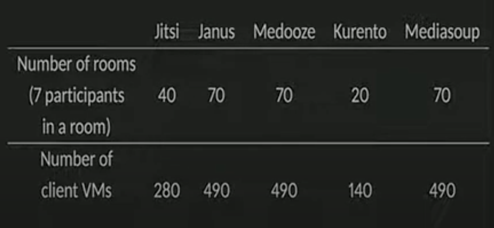

# Video Conferencing

- [Jitsi](https://github.com/jitsi/jitsi-meet)
- [Medooze](https://github.com/medooze/media-server)
- [Ant Media](https://github.com/ant-media/Ant-Media-Server)
- [Kurento](https://github.com/Kurento/kurento-media-server)
- [Mediasoup](https://github.com/versatica/mediasoup)
- [Janus](https://github.com/meetecho/janus-gateway)
- [OBS Studio](https://github.com/obsproject/obs-studio)
- [Big Blue Button](https://github.com/bigbluebutton/bigbluebutton)
- [Jami Project](https://git.jami.net/savoirfairelinux/ring-project)
- [Testing WebRTC](https://github.com/webrtc/KITE)

## SFU
In the SFU architecture, every participant sends his or her media stream to a centralized server (SFU) and receives streams from all other participants via the same central server. The architecture allows the call participant to send multiple media streams to the SFU, where the SFU may decide which of the media streams should be forwarded to the other call participants. SFU fallback to lowest quality in the network.

Without the issue of legacy endpoints, the SFU architecture provides better scaling properties. It requires far less computing power on the server, since the computing requirements are delegated to the endpoints, which may be quite heavy for some mobile clients. It is also closer to the end-to-end principle, upon which the Internet is built. On the other hand, the SFU architecture has higher requirements on network bandwidth than the MCU architecture, as the number of media streams sent and received is usually higher.

- **Turn server vs SFU**

- SFU
    - For each PeerConnection the SFU will listen on a random UDP (and sometimes TCP port)
    - This IP/Port combination is giving to each peer who then attempts to contact the SFU.
    - The SFU then checks the incoming packets if they contain a valid hash (determined by upwd)- This ensures there is no attacker connecting to this port.

- Turn Server
    - Provides a single allocation port that peers can connect to. You can use UDP, DTLS, TCP or TLS. You need a valid username/password.
    - Once authenticated you send packets via this connection and the TURN server relays them for you.
    - The TURN server will then listen on a random port so that others can then send stuff back to the Peer.

You only have to listen on a single public port.
You can also make your service available via UDP, DTLS, TCP and TLS. Most ICE implementations only support UDP.
You have networks that only allow TLS traffic over port 443. So a TURN server is your only solution 
 
## MCU
The MCU architecture assumes that each conference participant sends his or her stream to the MCU. The MCU decodes each received stream, rescales it, composes a new stream from all received streams, encodes it, and sends a single to all other participants.

The MCU approach requires very little intelligence in device endpoints, as the majority of the logic is located in the MCU itself. The unit can generate output streams with different quality for different participants depending on their specific downlink conditions. This makes MCUs a solid solution for low capacity networks.

## Adaptive Bitrate
Adaptive bitrate streaming is the adjustments to video quality according to the network quality. In other words, if the network quality is low then video bitrate is decreased by the server. This is necessary to provide uninterrupted streaming under low-quality network connections. Clearly, the different bitrates of the stream must be available to provide adaptive bitrate technique. One way to have different bitrates of the stream is the transrating. Namely, the server produces different streams with different bitrates from the original stream. However, transrating is expensive in terms of processing power.

## Simulcast
- The publisher sends multiple streams with different bitrates instead of one stream. 
- The server selects the best stream for the clients by considering the network quality.

## SVC
- Instead of multiple stream, multiple layers.
- Temporal scalability future of SVC.

## SSRC
Identifies the synchronization source. The value is chosen randomly, with the intent that no two synchronization sources within the same RTP session will have the same SSRC. Although the probability of multiple sources choosing the same identifier is low, all RTP implementations must be prepared to detect and resolve collisions. If a source changes its source transport address, it must also choose a new SSRC to avoid being interpreted as a looped source

## Notes
- For the media streams, WebRTC is RTP under the hood.
- Janus plugin based, Medooze bare minimum.
- Jitsi supports last N.

# Reference
- [Benchmark Conferencing](https://www.youtube.com/watch?v=wrp73yYE8Ck)
- [AntMedia](https://antmedia.io/webrtc-servers)
- [Simulacast](https://voximplant.com/blog/an-introduction-to-selective-forwarding-units)

# Talk
- [Medooze talk](https://www.youtube.com/watch?v=u8ymYTdA0ko&ab_channel=CommCon)
- [Jitsi](https://www.youtube.com/watch?v=27KW7HaPai8)
- [Jitsi Videobridge](https://www.youtube.com/watch?v=wwhT_Y0ex0A)