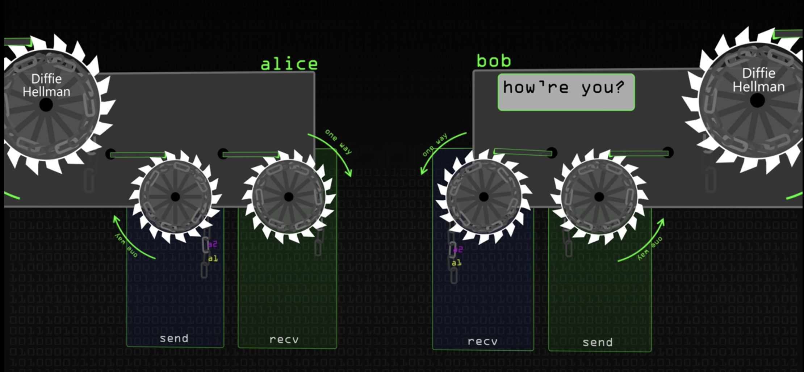

# OTR
- Off the record
- As OTR sessions existed between exactly two clients, the chat history would not be synchronized across other clients of the involved parties. Furthermore, OTR chats were only possible if both participants were online at the same time, due to how the rolling key agreement scheme of OTR worked.

# Omemo

# Signal protocol
- Prekey bundle
    - IPKb - identity private key bundle
    - SPKb - Signed private key bundle
    - OPKb - Optional private key bundle
- Triple diffie hellman
- Safety number
    - Concat the public key of both party. And check this out of bound.
- Signal changes key to every single message.

      

## Replay Attack

## Forward Secrecy
- Forward secrecy (FS), also known as perfect forward secrecy (PFS), is a feature of specific key agreement protocols that gives assurances that session keys will not be compromised even if long-term secrets used in the session key exchange are compromised.
For HTTPS the long-term secret is typically the private signing key of the server.
The session key is kept different and changed over long period of time.

## Double ratchet algorithm / Axolotl Ratchet
- The key is gone through KDF.

# Resources
- https://xmpp.org/extensions/xep-0384.html
- https://en.wikipedia.org/wiki/Forward_secrecy
- https://www.youtube.com/watch?v=vsXMMT2CqqE