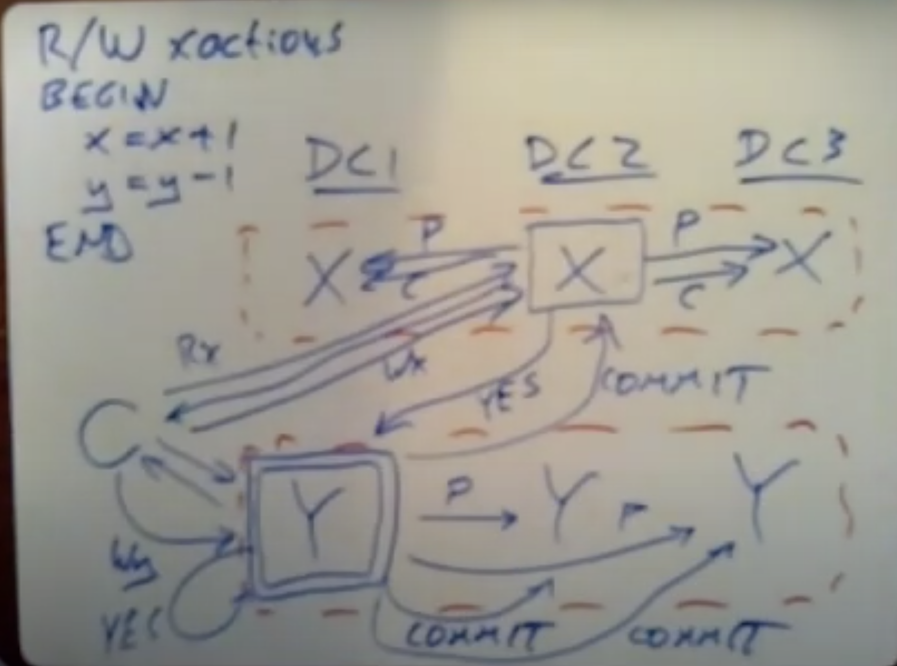

# MIT Parralal & Distributed OS Group

- [**Course Link**](https://pdos.csail.mit.edu/6.824/schedule.html)

## Introduction
- Mapreduce explanation
- general Phinlosophy

## RPC & Threads
- Threads vs even driven asyncronous programming
- To get Parrelalism + IO Concurrency fill all thread equal to core with event driven loop.
- Go threads are cleverly run on one os thread.
- Code snippets in go crawler explained.

## GFS
- Two phase commit

## Primary-Backup Replication
- Multi core bad for replicated state machine

## Blockstack
- Cryptographic ACL needs Public Key Infrastructure
- Burn Address gets some fee for registering name
- Certificate Transparency

# Fault Tolerance
- Use of leader in distributed concensus
    - Original Paxos dnt have a leader
    - First round to elect a leadr, second to decide
    - In raft, leader elected. So speeds up by factor of two.
    - Sequence of leaders identified by followers using term.
    - Back up. Fast.
    - Log Compaction.
    - Linearizability - All concurrent parallal requests map to one dimention.

# ZooKeeper
- Raft usage requires explicit use in application which gives distributed concensus
- Zookeeper gives same as a co oord ination service
- zookeeper zab, raft like
- Writes linearizable, gives zxID, Read fifo client with zxID
- Primary backup system, not state machine replication.
- Configuration management through read locking `ready` file.
- Mini Transaction
    - Master state transfer, elect.
    - Test & Set.
- Api involves a naming system called 'zNodes'.
    - Regular permanent zNode
    - Ephimeral zNode - Client need to continuously end heartbeat to keep it
    - Sequential
- herd effect    

# CRAQ
- Chain Replication
- Maintains linearizability unlike zookeeper
- Uses configuration manager. Raft, Paxos, ZooKeeper.
- No worry about partition, split brain
  
# Aurora
- In each machine, Virtual machine monitor to monitor ec2
- Website is constructed of stateless services that get persistent data from DB.
- EC2 not good for DB. As not stateless like service.
- EBS volume are servers using CRAQ.
- Database on network generates lots of traffic.
- DB
    - Transation
    - Crash   Recovery 
- Instead of RDS architecture, aurora just sends log entries, ack from quoram only.    

# Frangipani
  - Cache coherence
  - Atomicity
  - Crash recovery
- Shared read lock
- Exclusive write lock 

Cache coherence lock to how updated write, Transactional to delay
  
WAL for crash recoverable transaction, Log on petal
 
# Distributed Transaction
- Transaction
    - Concurrency control
        - Pessimistic 
            - Locking 
                - More conflict then use it 
            - Two phase locking 
                - Lock and release at end.
            - Two phase commit 
                - Distributed xaction 
                - When the content of atomic commit in different server.
            - Transaction Coordinator 
                - Log update as early as possible
            - Two phase commit and raft 
        - Optimistic
     - Atomic commit
- Serializable or atomic
    - Sequence change but no intermediate state

# Spanner
- CockroachDB uses a lot of design
- Sharding - key design
- Transactions over multiple shrad 
- Paxos replecated
- Transaction
    - Read Write Transaction
    - Read only transaction
        - Serializable
        - Snapshot isolation
            - TimeStamp 
                - R/W Transaction - Commit Time
                - R/O Transaction - Start Time 
        - In case in minority paxos group, delay until
                  
        - External Consistency
            - RO/RW transactions should not see stale data
            - Multi version DB

- Data across data centers

# Optimistic Concurrency Control
- FARM - Optimized for one data center
- NVRAM
    - Machine with battery attached
- Kernel bypassing
- RDMA Network Interface Card

 # Spark
 - Lineage Graph
    - Narrow dependency
    - Wide dependency - Distinct
- Not good for stream processing
- Instead of GFS writing in mapreduce, rdd can be retained in memory.

# Cache consistency
- Four architecture
    - Single Server + DB Server
    - Multiple Server + One DB Server
    - Multiple Server + Sharded DB Server (Hotspot problem)
    - Multiple Server + Cached
- Look aside cache
- Look through cache
- In cache of memcache failure dramatic increase in DB Server
- Asyncronous log replicated scheme for replication
- RPC call to memcache
    - Cache invalidate scheme - better
    - Cache update scheme    
 partition:
    + more memory-efficient (one copy of each k/v)
    + works well if no key is very popular
    - each web server must talk to many mc servers (overhead)
  replication:
    + good if a few keys are very popular
    + fewer TCP connections
    - less total data can be cached
- When adding a new cluster, no cache can cause a lot of problem
    - Solution: Cold Mode
- Thundering Herd
    - Solve by using lease. Just a flag.
- Gutter Server
- Race condition
    - Read, miss, but before set write, invalidate happens      

# Casual Consistency
- Interact with only local
- Usage - Cassandra, Dynamo
- Versioning
    - Wall clock

- Photo put, List get example.
- Sync to maintain order. Too slow. 
- Better approach log server. But centralizaed log means heavy load.
- Dependency maintain. Better approach.

# Certificate Transparency 
- Merkle inclusion proof
- Log consistency proof

# Bitcoin

# Blockstack

## Final Project
- Search 6.824

---- 

# [CSE 138](https://www.youtube.com/watch?v=G0wpsacaYpE&list=PLNPUF5QyWU8O0Wd8QDh9KaM1ggsxspJ31&ab_channel=LindseyKuper)

**Lecture 2**
- Distributed Systems = Partial Failure + Unbounded Latency
- Pysical Clock 
    - Time of day clock
        - Synced with NTP
        - bad for duration, time label
    - Monototic clock
        - counter
        - bad for time label
        - good for duration
- Logical Clock
    - only orderinig of event

**Lecture 3**
Lamport Diagrams/ Space Time Diagrams

A -> B when,
- A happens before B in same machine
- A send B receive in different machine
- transitive closure

- Causal anomaly

Network mode
- Syncrobous 
- Asyncronous

# Waterloo
 
Lecture 1
- Any big thing structure. Hiererchy 
- DNS
- Implicit hierarchy
- Ip addr geographically dispered
- Split up geo or data center 
- topology

Lecture 2
youtube pull replication
push replication for popular

DNS
cn - Canonical name
ns - Name Server
a - Address

Lecture 6
- SOCKET TABLE
    - SOCKET is an index to socket table, which has all information necessary.
    - SOCKET File Descriptor is an index. Just integer.
- SOCK ADDR_IN
    - Address family
        - AF_INET
        - AF_unix (Client server on same machine)
    - IP address
        - From client - Server IP
        - From server - Any
    - Port number
        - From client - Server's port
        - From server - Listen on port
- HOST ENT
    - Destinition
        - What is returned by DNS?
- TCP - SOCK_STREAM - CONNECTION ORIENTED
- UDP - SOCK_DGRAM - DATAGRAM

- htons(PORT -> host byte order to network byte order
- [Socket programming](https://www.youtube.com/watch?v=2QeL7jo_LIw&list=PLawkBQ15NDEkDJ5IyLIJUTZ1rRM9YQq6N)

- [SOCEKT PROGRAMMING](https://www.geeksforgeeks.org/socket-programming-cc/)   

Lecture 7
- Flow control part of transport layer
- Congestion control part of network layer
- Ports are 16 bits

Lecture 8

----

 