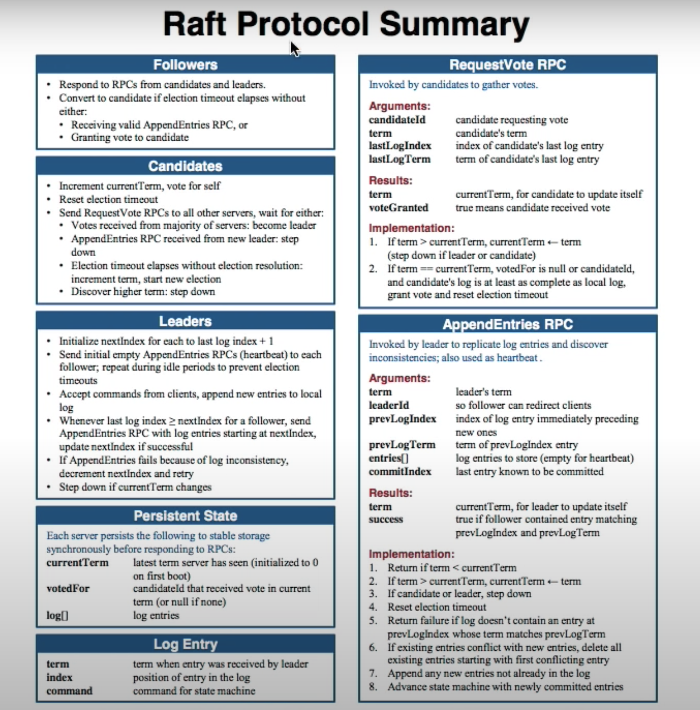
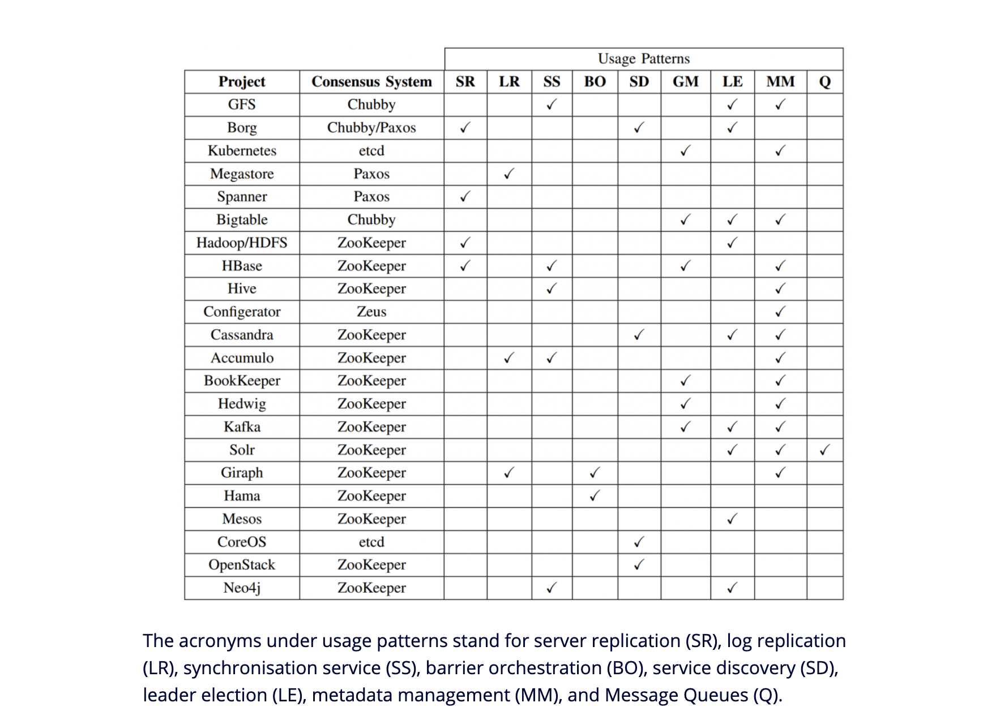

# Paxos
Quoram Agreement

# Concensus
State machine replication based on log
- Symmetric
    - Equal roles
    - Can contact any server
- Asymmetric
    - Leader base
    - raft  

# Raft
6 basic operations of raft.

- Leader Election
- Normal Operation
- Safety consistency after leadr change
- Neutralizing old leaders
- Clients interaction
    - Linearizable Semantics where each client interaction happens exactly once
- Configuration changes
    - Adding or removing servers    

Each Server can have three states
    - Follower state
    - Leader state
    - Candidate state
- Time divided into terms
    - Obsolete events
- Each server maintains current term
- Only two RPC and tree persistent state

     
 - Leader must give empty heartbeat to all followers. Empty appendentries.
 - ElectionTimeout - time span for leader choice.
 - Safety - Liveness for leader election
 - To eventually select one random timeout necessary 

 ### log
    - Commited log persisted on disk in majority of servers
    - Leader never overrides a log, it appends
    - Future leaders must have all commited log 
- Leader does not respond until command has been logged, commited, executed by leaders state machine.
- Exactly once linearizability from unique key
- Configuration changes must have two phases

 Zookeeper is based on Zab (a protocol similar but not the same as Paxos), and etcd is built on top of Raft – the protocol about which this blog post speaks.

 ## References
 - https://www.youtube.com/watch?v=YbZ3zDzDnrw&feature=youtu.be    