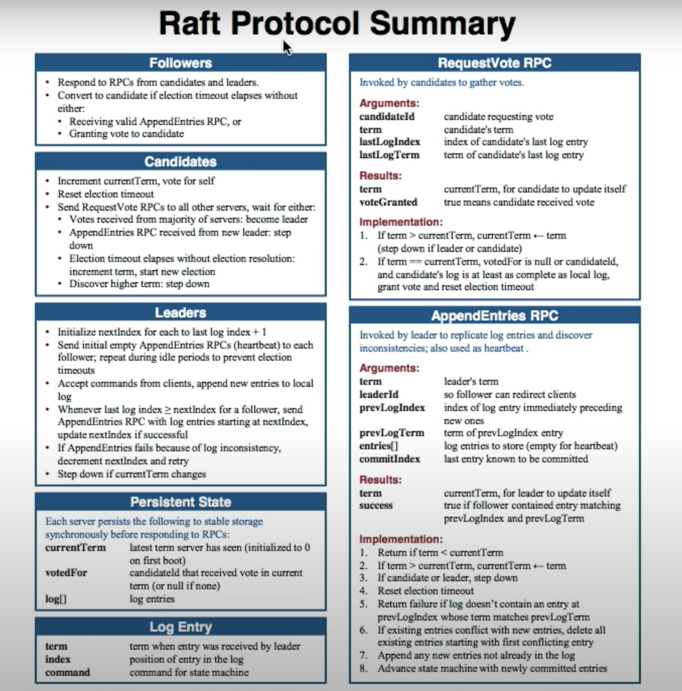
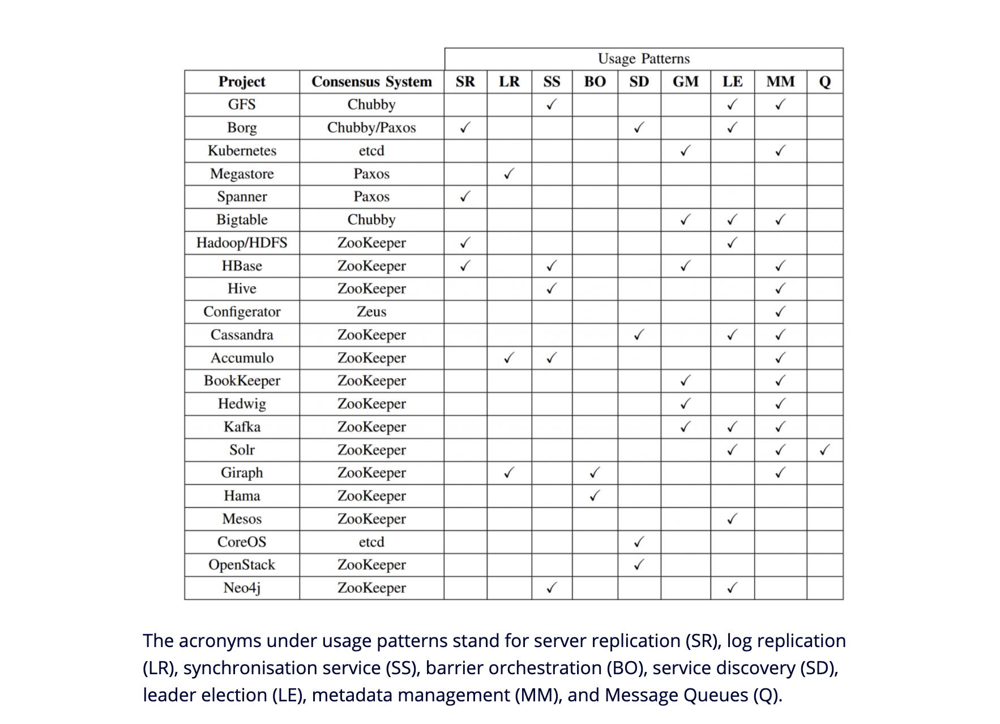

# Raft

Raft uses a strong leadership model, wherein one of the replicas in the cluster serves as a leader and others serve as followers.

6 basic operations of raft.

- Leader Election
- Normal Operation
- Safety consistency after leader change
- Neutralizing old leaders
- Clients interaction
    - Linearizable Semantics where each client interaction happens exactly once
- Configuration changes
    - Adding or removing servers    

Each Server can have three states
    - Follower state
    - Leader state
    - Candidate state
- Time divided into terms
    - Obsolete events
- Each server maintains current term
- Only two RPC and tree persistent state

     
 - Leader must give empty heartbeat to all followers. Empty appendentries.
 - ElectionTimeout - time span for leader choice.
 - Safety - Liveness for leader election
 - To eventually select one random timeout necessary 

 ### log
    - Commited log persisted on disk in majority of servers
    - Leader never overrides a log, it appends
    - Future leaders must have all commited log 
- Leader does not respond until command has been logged, commited, executed by leaders state machine.
- Exactly once linearizability from unique key
- Configuration changes must have two phases

 Zookeeper is based on Zab (a protocol similar but not the same as Paxos), and etcd is built on top of Raft – the protocol about which this blog post speaks.

### Term
A term is the period of time for which a certain server is a leader. A new election triggers a new term, and the Raft algorithm ensures that a given term has a single leader.

### Notes
- Raft shouldn't be used for traffic-heavy services. It's more suitable for low-traffic scenarios where consistency is critical, at the possible expense of availability
- When working with a Raft cluster, a client knows the network addresses of the cluster's replicas. How it knows this (e.g. by using some sort of service discovery mechanism)
- Raft wasn't designed for high-throughput, fine-grained services. Every client request triggers quite a bit of work - communication between Raft replicas to replicate it to a majority, as well as persist it; all before a client gets a response.
- Use Case
    - Implementing a lock server, 
    - Electing leaders for higher-level protocols, 
    - Replicating critical configuration data in a distributed system

## Resources
- https://eli.thegreenplace.net/2020/implementing-raft-part-0-introduction/
- https://www.youtube.com/watch?v=YbZ3zDzDnrw&feature=youtu.be
- https://blog.container-solutions.com/raft-explained-part-1-the-consenus-problem
- https://raft.github.io/raft.pdf