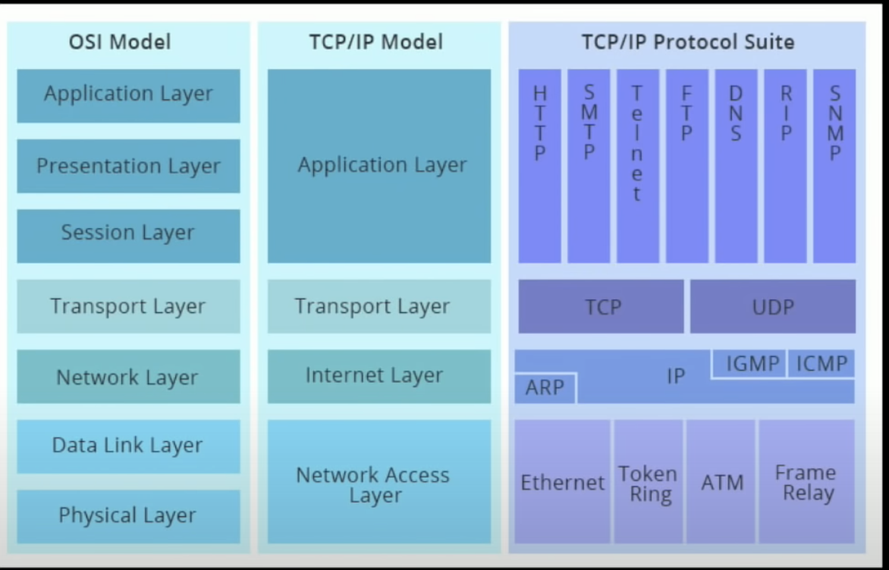

# libp2p



p2p network composed of four elements
- Each node identified by `public key`
    - Hash of small data structure containing RSA, ed25519, ecp256k1 etc
- `Peer Discovery` system, joining.
    - Discover nodes on  local network, DNS, DNS-SD.
    - Bootstrap node 
- pubsub to broadcast event
- `DHT` to store data

p2p connection
- [Demo Project](https://github.com/tomaka/2018-rustrush-demo)
- open a connection
- negotiate encryption protocol
- on top of encryption multiplexing protocol
    - [yamux](https://github.com/hashicorp/yamux)
- each high level request opens up substream


---
- IPFS Content addressing
    - Find, Fetch, Authenticate
- libp2p Process Addressing
    - Find, Connect, Authenticate
- MultiAddress
    - A Multiaddr is a self-describing network address and protocol stack that is used to establish connections to peers.
    
```
Some examples:

/ip4/80.123.90.4/tcp/5432
/ip6/[::1]/udp/10560/quic
/unix//path/to/socket
```

# Resources
- [libp2p introduction](https://www.youtube.com/watch?v=CRe_oDtfRLw)
- [quic](https://www.youtube.com/watch?v=4FvMed5iCb4)
- [libp2p R ust](https://www.youtube.com/watch?v=Sss2Tl7WRDQ)