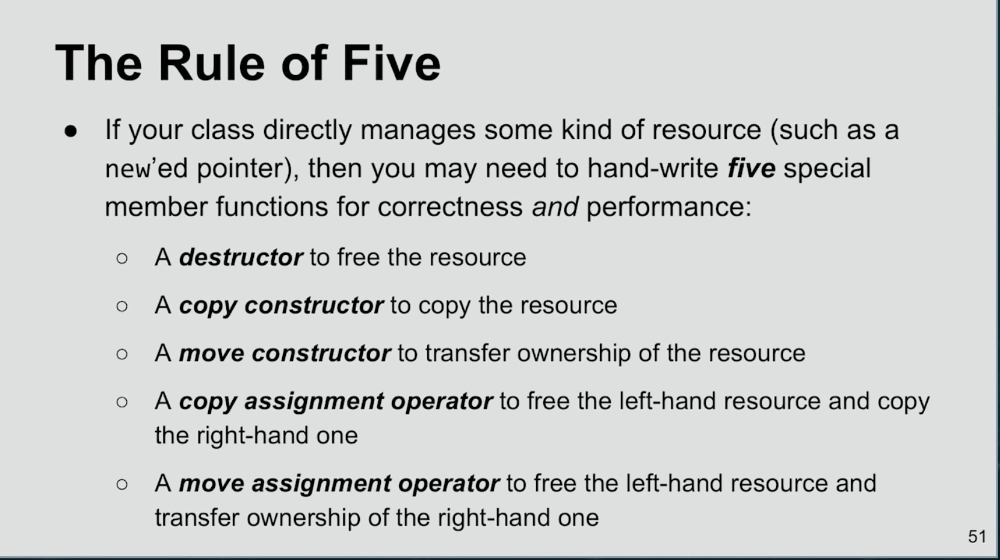

# c++

- Library
    - Boost
    - std
    - abseil

### constexpr
- [constexpr concept](https://www.geeksforgeeks.org/understanding-constexper-specifier-in-c)

- [CppCon 2015: Scott Schurr “constexpr: Introduction”](https://youtu.be/fZjYCQ8dzTc)
    - Moving computation from runtime to compile time
    - No syncronization concern
    - Can be applied in `value` or `computations`
    - [Incomplete]

### Template Metaprogramming
    
- Vector push is defensive is case of move operation, using `no except` optimizes a lot
- If not fallback to pre c++11 and use copy
- Perfect forwarding
- Reflection
- `free` call free the memory but not the pointer to that. So in production codebase `free Null` pattern arises
- Before, `move` semantics, `static_case<std::string&&>` would do the same
- `Literals` are assignable


## Backlogs

- By default C++ exception do not capture their execution context (backtrace), so when a generic exception occurs you don’t know what code actually generated it.

- C++ has lot of unsafe API and its extremely easy to do unsafe operations like accessing a forbidden area in memory thanks to pointer of trying to acces an array/vector past its allocated area. This lead to instability and lot of time spent trying to find and fix the code.

- C++ has 3 ways to deal with objects: objects, references and pointers. Each one has its pro and cons, its not as obvious to use as you might think. Lot of errors are made using the wrong one and you spend more time thinking about this kind of stuff than in other languages.

- C++ polymorphism is a pain in the ass to use. Its only fully work on smart pointer or shared pointer. C++ reference works, but only partially.. And having to use pointers everywhere is annoying.

- C++ template are extremely powerful but they are also very complex to use correctly and lot of complexity comes with it.

- C++ lack interfaces and true modules. The header mechanism is inefficient, verbose and the namespace mechanism is not as standardized and clear as in many other languages.

There no standard package managers and repositories. If you stick to an operating system you can use say debian packages and docker as an example. But nothing universal or self contained in the language.

- Until recently (C++ 11) C++ had no lambda. Until C++ 14 lambda where quite verbose. They are still annoying to use and expressing something as callable for example is not as straightforward as it should be, in particular if you want to return a callable.

- C++ has still no easy introspection library.

- C++ compilation is very slow and C++ debugging too. Outside of very basic code, each time you debug a program or unit test you lose time compared to doing it in language like java or C++. Also the available C++ build systems are more complex to use than what you find in other programming languages.

- If C++ uses AVL for it’s std::map and Rust uses red/black for it’s equivalent, then C++ would have faster lookups where Rust would have faster insert/remove.

- An intrusive list is one where the pointer to the next list node is stored in the same structure as the node data. This is normally A Bad Thing, as it ties the data to the specific list implementation. Most class libraries (for example, the C++ Standard Library) use non-intrusive lists, where the data knows nothing about the list (or other container) implementation.

## Snippet

```shell
g++ -fdump-class-heirarchy a.cpp
```



# Reference

- [Quroa c++ backlog](https://www.quora.com/Instead-of-inventing-a-ton-of-high-level-programming-languages-why-dont-people-implemented-C-C-frameworks-to-perform-high-level-repetitive-tasks)

- [Intrusive list](https://stackoverflow.com/questions/3361145/intrusive-lists)

- [Move semantics](http://www.open-std.org/jtc1/sc22/wg21/docs/papers/2006/n2027.html#Move_Semantics)

- [Perfect forwarding](http://thbecker.net/articles/rvalue_references/section_01.html)

- [lvalue rvalue](https://www.internalpointers.com/post/understanding-meaning-lvalues-and-rvalues-c)

- [Resource Management](https://www.youtube.com/watch?v=7Qgd9B1KuMQ)
    - Explains various c++ resource management
    - Free in destructor
    - Copy constructor to copy heap
    - Assignment, copy and swap
    - Should have no exception thrown between allocation and free
    - Disable logging, then enable it should have no code or return in between

- [C++ Memory Model](https://www.youtube.com/watch?v=UNJrgsQXvCA)
    - Talks mainly about c++ memory model
    - `move semantics` use case explain
    - `byte ordering` for c++

- [Type Erasure](https://www.youtube.com/watch?v=tbUCHifyT24)
    - https://stackoverflow.com/questions/18085331/recursive-lambda-functions-in-c14
    - [Incomplete]

- [CPPCon Slide Collection: ](https://github.com/CppCon/CppCon2019) contains cpp conference presentations on variour topic

- [CppCon 2017: Fedor Pikus “C++ atomics, from basic to advanced. What do they really do?”](https://youtu.be/ZQFzMfHIxng)
    - Used for lock free programming

    - Presentation application based
        - Mutex based
        - Lock free / Wait free

    - Any trivially copyable type can be made atomic
        - `x *= 2` is not atomic
        - `x = x + 1` is not atomic, same as `x++` unless x is atomic
        - `x = x * 2`  is not atomic, these are two separate  atomic operation
        - no atomicity for floating point numbers.
        - Explicit `load`, `store`, `exchange`, `compare_and_swap` available

    - The concept of atomicity scales from single instruction to whole program
        - Single add operation
        - Client seeing db state before after update

    - Algorithm rules supreme
        - Should not delve into details of implementation too soon. Algorithm decides everything.

    - Lock free but not wait free version
        - ```c++
            std: atomic<int> x { 0 };
            int x0 = x;
            while( !x.compare_and_swap(x0, x0 + 1); )
           ```
        - Will continue while other change and add with the latest value only. Supports all sort of operations

    - Atomics and locks generally provide thread safe way to do things

    - Benchmark different operations in lock vs mutex, atomic operaions vs normal vs spinlock

    - Memory barriers