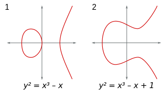
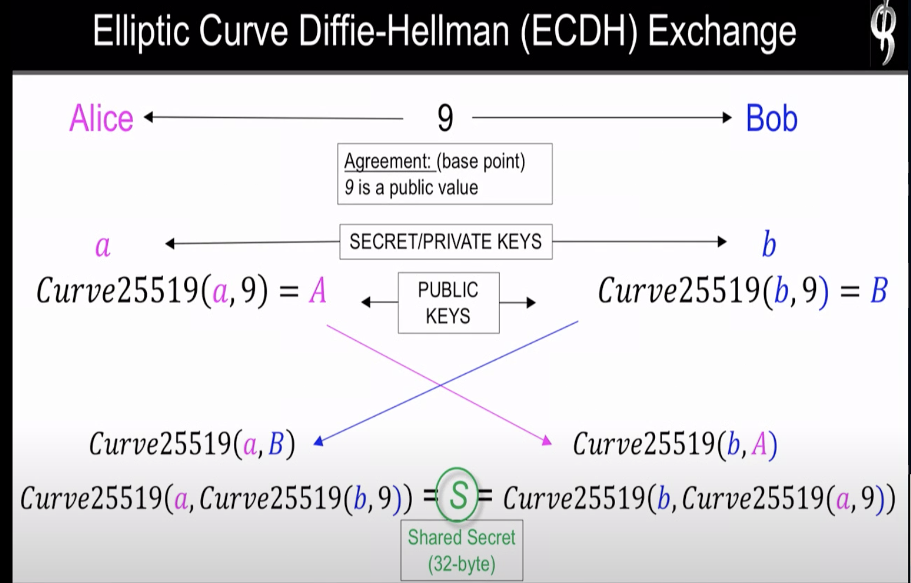
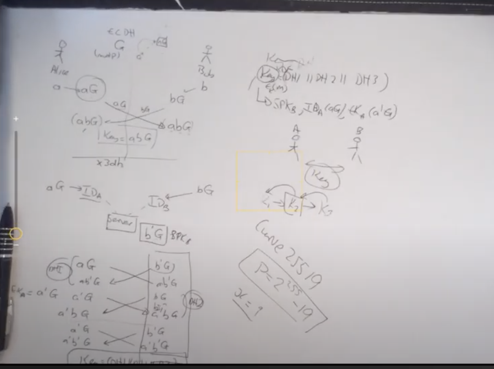
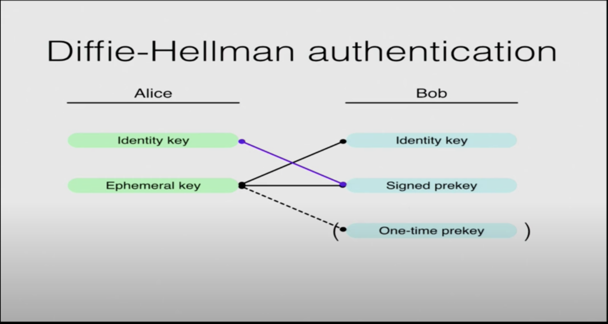

# OTR
- Off the record
- As OTR sessions existed between exactly two clients, the chat history would not be synchronized across other clients of the involved parties. Furthermore, OTR chats were only possible if both participants were online at the same time, due to how the rolling key agreement scheme of OTR worked. This one not used now. Repalced by siognal protocol.

---

# Signal protocol
- Prekey bundle
    - IPKb - Identity public key bundle
        - Generated once and saved locally
    - SPKb - Signed public key bundle 
        - To verify control over the public key
        - Generated once and saved locally
    - OPKb - Optional private key bundle 
        - Used for session establishment when offline
        - Uploaded to keybase on server
        - Once fetched by the counterpart it is deleted from keybase / server
        - When received from counterpart with this key it is deleted from local list as well to avoid replay attack. 
        
- Triple diffie hellman used to establish initial session to agree on a root key.
- Then that root key is used for Double rachet or passing through KDF to generate new key
- Signal changes key to every single message. This give perfect `forward secracy`.
- Safety number
    - Concat the public key of both party. And check this out of bound.


---

## EC_DH_RSA
- Elliptic curve diffie hellman RSA.



The elliptic curve used in Signal Protocol is  Curve25519.

Prime Number , p = `2^255 - 19`
base point, x = 9

```math
y^2 = x^3 + 486662 x^2 + x
```


- Why Diffie hellman and RSA both used for session key establishemnt?
    - Only RSA can be used for session key agreement. Just send counteraprt's public key. Generate a random session key. Counterpart decrypts it and gets the session key. But it looses forward secetecy as compromised private key can decrypt all past messages.
    - Only diffie hellman has man in the middle attack.
    So RSA needed. Authenticated diffie hellman key exchange.




---

## Extended Tripple Diffie-Hellman x3dh

IPKa - a's Identity Public Key
EPKa - a's Ephimeral Public key (Generated once for usage)


IPKb - b's Identity Public Key
SPKb - b's Signed Public Key
OPKb - b's One Use Public key (Chosen from a list of 100 available)




- Used for session establishement of Signal Protocol.
      
---

## Forward Secrecy
- Forward secrecy (FS), also known as perfect forward secrecy (PFS), is a feature of specific key agreement protocols that gives assurances that session keys will not be compromised even if long-term secrets used in the session key exchange are compromised.
For HTTPS the long-term secret is typically the private signing key of the server.
The session key is kept different and changed over long period of time.

- Forward Secracy comes from Scimp
- Future Secrecy comes from OTR 
- PGP lacks deniability 

----

## Double ratchet algorithm / Axolotl Ratchet

- Once the session established then the key goes through a one way function that acts as ratchet to generate more key.
- The key is gone through KDF (Key Derivation Function).
- Even if one key is broken cant get decrypt any prevoiuosly encrypted message.
- But can read future message as KDF available. No forward secrecy. Solution: Involve Diffie Hellman in ratchet.
- Signal update the key every single message.
- Each particiant has 3 rachets.
    - DH Rachet
    - Sending Rachet
    - Receiving Rachet
- The initial state of this chain is established by session agreement.


---

# PreKeys
This protocol uses a concept called 'PreKeys'. A PreKey is an ECPublicKey and an associated unique ID which are stored together by a server. PreKeys can also be signed.
It is used for asyncronous encrytion. As the other client can be offline for several months.

- Ellyptic curve - curve25519 is used for public private key pair generation.
- For storing pre keys PKI infra needed. Keybase.

At install time, clients generate 
- Identity Key
- A single signed PreKey
- List of unsigned PreKeys (As per protocol 100 prekeys) and transmit all of them to the server.

---

# Sessions

Signal Protocol is session-oriented. 
Clients establish a "session," which is then used for all subsequent encrypt/decrypt operations.
There is no need to ever tear down a session once one has been established.

Sessions are established in one of three ways:

- PreKeyBundles: A client that wishes to send a message to a recipient can establish a session by retrieving a PreKeyBundle for that recipient from the server.
- PreKeySignalMessages: A client can receive a PreKeySignalMessage from a recipient and use it to establish a session.
- KeyExchangeMessages: Two clients can exchange KeyExchange messages to establish a session.

---

# State
An established session encapsulates a lot of state between two clients. That state is maintained in durable records which need to be kept for the life of the session.

State is kept in the following places:

- Identity State. Clients will need to maintain the state of their own identity key pair, as well as identity keys received from other clients.
- PreKey State. Clients will need to maintain the state of their generated PreKeys.
- Signed PreKey States. Clients will need to maintain the state of their signed PreKeys.
- Session State. Clients will need to maintain the state of the sessions they have established.

---

# Workflow
- Alice Bob communicating
- Bob publishes his public key in Key Directory
- Alice fetches from it key from it.
    - Normal approach would be to just generate a session key, encrypt it with bob's key and send. But it looses forward secrecy.
    - Second approach use one prekey signed so it is verified that it is linked to Identity key. But has no forward secrecy. Timed change of this prekey. 
- Protocol uses a combination of those.   
- So protocol says a set of one time prekey generated as well. So received message will be decrypted by both identity and prekey. Later deleted for forward secrecy. Outcome shared session key.
- End to end encrytion is east. End to end authentication is not.




## Group Message Encryption - [reference](https://www.youtube.com/watch?v=tCKd6xBqyDw)

- Creating one shared group key, send it to server for fan out instead of pairwise encryption.
- Sender keys does not have post compromise security.

---

# Omemo
A high level intro on how Omemo works: Each device gets it’s own public/private key pair. When a message is sent, it is encrypted with a message-specific key. This key itself is encrypted with the public key of each client participating in the chat. So if you have multiple devices, the message-key is encrypted for each of your devices. Same holds true for all devices of the person you are communicating with. If you are in a group chat, then the message-key is encrypted for everyone’s device participating in the group. For decryption each device decrypts the message-key, then takes the message-key and decrypts the potentially long message. This procedure enables bandwidth-efficient multi-user multi-device encryption. Each device public key can be represented via a fingerprint. When you send a message to someone, you need to be sure that this person is actually the person they claim to be. That explains the existance and necessity of fingerprint verification. The current scheme is trust-on-first-use (TOFU), meaning the first fingerprint is trusted. New fingerprints you have to manually trust. You should check in person, or via the phone with your comunication partner if the fingerprints match.

## SSL Pinning
- Pinning certificate of one definite server in app to avoid DNS poisoning .
-  As mobile apps are connecting to one backend everytime, it makes sense.
- Trust on first sight

```bash
## Certificate download and save
openssl s_client -showcerts -connect domain.com:443

## public key
openssl s_client -connect www.site.com:443 -CAfile rootcert.pem | openssl x509 -pubkey -noout | openssl rsa -pubin -outform der | openssl enc -base64 -d > publickey.der

## hash 
echo "tanmoy" | openssl dgst -sha256 -binary | openssl enc -base64

```


# Resources
- [Omemo Encryption Protocol Spec](https://xmpp.org/extensions/xep-0384.html)
- [Signal Protocol Concept Explained ** ](https://www.youtube.com/watch?v=7WnwSovjYMs)
- [Forward Secrecy](https://en.wikipedia.org/wiki/Forward_secrecy)
- [Key Exchange Problem. EC_DHE_RSA.](https://www.youtube.com/watch?v=vsXMMT2CqqE)
- [End to End encryption](https://youtu.be/oRZoeDRACrY)
- [History of Omemo from SCIMP. (Not that useful)](https://www.youtube.com/watch?v=JWOGol6dsI0)
- [X3DH - Extended Tripple Diffie Hellman](https://www.youtube.com/watch?v=_4muqgreEXE)
- [X3DH - Extended Tripple Diffie Hellman BLog](https://medium.com/asecuritysite-when-bob-met-alice/alice-whispers-to-bob-at-the-core-of-privacy-in-the-21st-century-is-extended-triple-51736dad527d)
- [Group message](https://www.youtube.com/watch?v=tCKd6xBqyDw)
- [Signal - X3DH](https://signal.org/docs/specifications/x3dh/)
- [Certificate Pinning](https://www.youtube.com/watch?v=3coPpYJgFro )
- [Asyncronous Security](https://signal.org/blog/asynchronous-security/)
