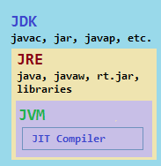

# JVM

- What is `JRE`?
    - The JRE is the Java Runtime Environment. It is a package of everything necessary to run a compiled Java program, including the Java Virtual Machine (JVM), the Java Class Library, the java command, and other infrastructure. However, it cannot be used to create new programs.
- What is `JDK`?
    - The JDK is the Java Development Kit, the full-featured SDK for Java. It has everything the JRE has, but also the compiler (javac) and tools (like javadoc and jdb).

    

Three major component
- Class Loader
    - Loading
        - Bootstrap class loader
            - Loads system jar `rt.jar` class to memory in `jre/lib` folder.
        - Extension class loader
            - Makes precompiled class files available to JVM
        - Application class loader
    - Linking
        - Verify
            - After class files loaded in memory, there is a verify phase to check conformance to standard.
        - Prepare
            - In prepare phase, memory for sattic varibles memory are allocated.
        - Resolve
            - Symbolic references are replaced with actual reference.
    - Initialization
        - Static variables and init initialized

- Runtime Data Area
    - PC Registers & Stacks per thread
    

- Execution Engine
    - Interpreter
        - Converts instruction to machine code
    - JIT
        - Hotspot machine code cached
        - Intermediate Code Generetor
        - Code Optimizer
        - Target code generetor
        - Profiler

# FootNotes
- The Java standard library needs to call into native code. For this purpose, the JRE contains some .dll (Windows) or .dylib (macOS) or .so (Linux) files under bin/ or lib/ with supporting, system-specific native binary code.