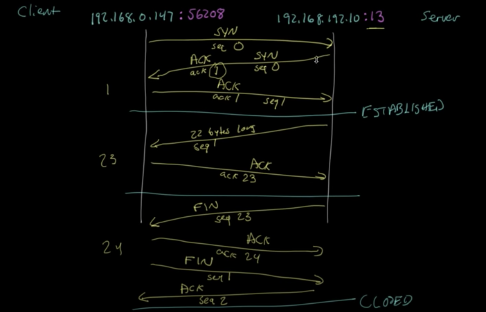
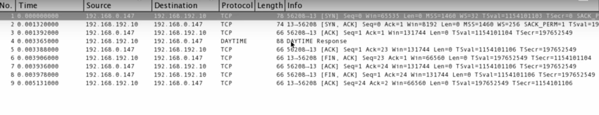
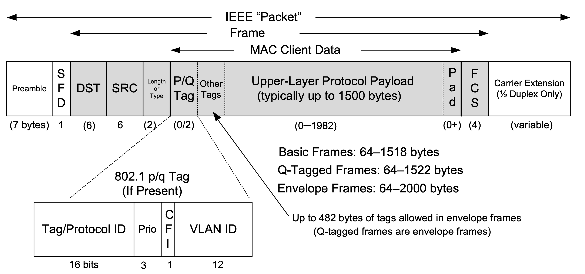

> Effective communication depends on the use of a common language.

# Introduction
- Diagnosing network protocols, is also a powerful tool for understanding how the network protocols operate.
- The design that specifies how various protocols of a protocol suite relate to each other and divide up tasks to be accomplished is called the architec- ture or reference model for the protocol suite.
-  Goals
    - Internet communication must continue despite loss of networks or gateways.
    - The Internet must support multiple types of communication services.
    - The Internet architecture must accommodate a variety of networks.
    - The Internet architecture must permit distributed management of its resources.
    - The Internet architecture must be cost-effective.
    - The Internet architecture must permit host attachment with a low level of effort.
    - The resources used in the Internet architecture must be accountable.
- In packet switching, “chunks” (packets) of digital informa- tion comprising some number of bytes are carried through the network somewhat independently. Chunks coming from different sources or senders can be mixed together and pulled apart later, which is called multiplexing.   
- When packets are received at a packet switch, they are ordinarily stored in buffer memory or queue and processed in a first-come-first-served (FCFS) fashion.
    - Statistical Multiplexing
        - In statistical multiplexing, traffic is mixed together based on the arrival statistics or timing pattern of the traffic. Such multiplexing is simple and efficient, because if there is any network capacity to be used and traffic to use it, the network will be busy (high utilization) at every bottleneck or choke point.
        - The downside of this approach is limited predictability—the performance seen by any particular appli- cation depends on the statistics of other applications that are sharing the network.
        - Statistical multiplexing is like a highway where the cars can change lanes and ultimately intersperse in such a way that any point of constriction is as busy as it can be.
    - TIme division Multiplexing
    - Static Multiplexing
        - Although such techniques can lead to more predictability, a fea- ture useful for supporting constant bit rate telephone calls, they may not fully uti- lize the network capacity because reserved bandwidth may go unused.
    - Virtual circuits (VCs) that exhibit many of the behaviors of circuits but do not depend on physical circuit switches can be implemented atop connection-oriented packets. This is the basis for a protocol known as X.25 that was popular until about the early 1990s when it was largely replaced with Frame Relay and ultimately digital subscriber line (DSL) technology and cable modems supporting Internet connectivity.
        - In X.25 the 12-bit logical channel identifier (LCI) or logical channel number (LCN) serves this purpose. At each switch, the LCI or LCN is used in conjunction with the per-flow state in each switch to determine the next switch along the path for the packet. The per-flow state is established prior to the exchange of data on a VC using a signaling protocol that supports connection establishment, clearing, and status information. Such net- works are consequently called connection-oriented. 
        - In the late 1960s, another option was developed known as the datagram. Attributed in origin to the CYCLADES [P73] system, a datagram is a special type of packet in which all the identify- ing information of the source and final destination resides inside the packet itself (instead of in the packet switches). Although this tends to require larger packets, per-connection state at packet switches is no longer required and a connectionless network could be built, eliminating the need for a (complicated) signaling proto- col. Datagrams were eagerly embraced by the designers of the early Internet, and this decision had profound implications for the rest of the protocol suite.
    - Message Boundaries: Applications write messages that are carried in protocols. A message boundary is the position or byte offset between one write and another. Protocols that preserve message boundaries indicate the position of the sender’s message boundaries at the receiver. Protocols that do not preserve message boundaries (e.g., streaming protocols like TCP) ignore this information and do not make it available to a receiver. As a result, applications may need to implement their own methods to indicate a sender’s message boundaries if this capability is required.
        - Datagram preserves
        - Tcp dont
    - Low level should not iplement error control, encryption, delivery acknowledgment
    - The end-to-end argument tends to support a design with a “dumb” network and “smart” systems connected to the network.
    - Fate Sharing: Fate sharing suggests placing all the necessary state to maintain an active communication association (e.g., virtual connection) at the same location with the communicating endpoints. With this reasoning, the only type of failure that destroys communication is one that also destroys one or more of the endpoints, which obviously destroys the overall communication anyhow. Fate sharing is one of the design philosophies that allows virtual connections (e.g., those implemented by TCP) to remain active even if connectivity within the network has failed for a (modest) period of time. Fate sharing also supports a “dumb network with smart end hosts” model, and one of the ongoing tensions in today’s Internet is what functions reside in the network and what functions do not.
    - 7 layers
    - One of the major benefits of a layered architecture is its natural ability to perform protocol multiplexing. This form of multiplexing allows multiple different protocols to coexist on the same infrastructure. It also allows multiple instantiations of the same protocol object (e.g., connections) to be used simultaneously without being confused.
    - When an object (packet, message, etc.), called a protocol data unit (PDU), at one layer is carried by a lower layer, it is said to be encapsulated (as opaque data) by the next layer down.
    - Any system with multiple interfaces is called multi- homed.
    - Address Reso- lution Protocol (ARP). It is a specialized protocol used with IPv4 and only with multi-access link-layer protocols (such as Ethernet and Wi-Fi) to convert between the addresses used by the IP layer and the addresses used by the link layer.
    -   forwarding is performed: unicast (destined for a single host), broadcast (destined for all hosts on a given network), and multicast (destined for a set of hosts that belong to a multicast group).
    - ping and traceroute, use ICMP
    - The Internet Group Management Protocol (IGMP) is another protocol adjunct to IPv4. It is used with multicast addressing and delivery to manage which hosts are members of a multicast group
    - Transmission Control Protocol (TCP), deals with problems such as packet loss, duplication, and reordering that are not repaired by the IP layer. It operates in a connection-oriented (VC) fashion and does not preserve message boundaries. Conversely, the User Datagram Protocol (UDP) pro- vides little more than the features provided by IP. UDP allows applications to send datagrams that preserve message boundaries but imposes no rate control or error control.
    - The PDU that TCP sends to IP is called a TCP segment.
    - UDP provides is a set of port numbers for multiplexing and demultiplexing data, plus a data integrity checksum.
    - Datagram Congestion Control Protocol (DCCP), specified in [RFC4340]. It provides a type of service midway between TCP and UDP: connection-oriented exchange of unreliable datagrams but with congestion control.
    - tream Control Transmission Protocol (SCTP), specified in [RFC4960]. SCTP provides reli- able delivery like TCP but does not require the sequencing of data to be strictly maintained. It
    -  At each layer there is an identifier that allows a receiving sys- tem to determine which protocol or data stream belongs together. 
    - An arriving Ethernet frame contains a 48-bit destination address (also called a link-layer or MAC—Media Access Control—address) and a 16-bit field called the Ethernet type.
    - The TCP/IP stack uses a combination of addressing information and protocol demul- tiplexing identifiers to determine if a datagram has been received correctly and, if so, what entity should process it. Several layers also check numeric values (e.g., checksums) to ensure that the contents have not been damaged in transit.
    - The value of 4 (and 41, which indicates IPv6) is interesting because it indicates the possibility that an IP datagram may appear inside the payload area of an IP datagram. This violates the original concepts of layering and encapsulation but is the basis for a powerful technique known as tunneling, which we discuss more in Chapter 3.
    - Secure Shell Protocol (SSH, port 22), FTP (ports 20 and 21), Telnet remote terminal protocol (port 23), e-mail/Simple Mail Transfer Protocol (SMTP, port 25), Domain Name System (DNS, port 53), the Hypertext Transfer Protocol or Web (HTTP and HTTPS, ports 80 and 443), Interactive Mail Access Protocol (IMAP and IMAPS, ports 143 and 993), Simple Network Management Protocol (SNMP, ports 161 and 162), Lightweight Directory Access Protocol (LDAP, port 389)
    - If we examine the port numbers for these standard services and other standard TCP/IP services (Telnet, FTP, SMTP, etc.), we see that most are odd numbers. This is historical, as these port numbers are derived from the NCP port numbers. (NCP, the Network Control Protocol, preceded TCP as a transport-layer protocol for the ARPANET.) NCP was simplex, not full duplex, so each application required two connections, and an even-odd pair of port numbers was reserved for each application. When TCP and UDP became the standard transport layers, only a single port number was needed per application, yet the odd port numbers from NCP were used.
    - p2p networks is called the discovery problem. That is, how does one peer find which other peer(s) can provide the data or service it wants in a network where peers may come and go? This is usually handled by a bootstrapping procedure whereby each client is initially configured with the addresses and port numbers of some peers that are likely to be operating. Once connected, the new participant learns of other active peers and, depending on the protocol, what services or files they provide.
    

# The Internet Address Architecture
- IP Address = Net Numbner + Host Number 
- Subnet Addressing
    - One of the earliest difficulties encountered when the Internet began to grow was the inconvenience of having to allocate a new network number for any new net- work segment that was to be attached to the Internet. This became especially cumbersome with the development and increasing use of local area networks (LANs) in the early 1980s. To address the problem, it was natural to consider a way that a site attached to the Internet could be allocated a network number cen- trally that could then be subdivided locally by site administrators.
- Directed broadcasts were found to be such a big problem from a security point of view that they are effectively disabled on the Internet today
- The special-use address 255.255.255.255 is reserved as the local net broadcast (also called limited broadcast), which is never forwarded by routers.
- Broadcast addresses are typically used with protocols such as UDP/IP (Chapter 10) or ICMP (Chapter 8) because these protocols do not involve two-party conversations as in TCP/IP. IPv6 lacks any broadcast addresses; for places where broadcast addresses might be used in IPv4, IPv6 instead uses exclusively multicast addresses
- Important examples of scopes include node- local (the address can be used only for communication on the same computer), link-local (used only among nodes on the same network link or IPv6 prefix), or global (Internet-wide). - 2.3.6.1
- Classless Inter-Domain Routing (CIDR)
    - Using CIDR, any address range is not predefined as being part of a class but instead requires a mask similar to a subnet mask, sometimes called a CIDR mask. CIDR masks are not limited to a site but are instead visible to the global routing system.
- To dramatically reduce the number of routing table entrie s while maintaining shortest-path routes to all destinations in the Internet. The best-known approach was published in a study of hierarchical routing
- The hierarchical routing idea can be used in a specific way to reduce the number of Internet routing entries that would be required other- wise. This is accomplished by a procedure known as route aggregation.
- The network topology were arranged as a tree1 and addresses were assigned in a way that was “sensitive” to this topology, very small routing tables could be used while still maintaining shortest-path routes to all destinations.
-  Scopes include node-local (same computer), link-local (same subnet), site-local (applicable to some site), global (entire Internet), and administra- tive.

# Link Layer
-  Frame as PDU
- Link-layer protocols can be carried inside other (link- or higher-layer) protocols, a technique known as tunneling.
- The particular method, known as carrier sense, multiple access with collision detection (CSMA/CD), mediates which computers can access the shared medium (cable) without any other special agree- ment or synchronization. 
- With CSMA/CD, a station (e.g., computer) first looks for a signal currently being sent on the network and sends its own frame when the network is free. This is the “carrier sense” portion of the protocol. If some other station happens to send at the same time, the resulting overlapping electrical signal is detected as a collision. In this case, each station waits a random amount of time before try- ing again. The amount of time is selected by drawing from a uniform probability distribution that doubles in length each time a subsequent collision is detected.
- A switched Ethernet network consists of one or more stations, each of which is attached to a switch port using a dedicated wiring path. In most cases where switched Ethernet is used, the network operates in a full-duplex fashion and the CSMA/CD algorithm is not required. Switches may be cascaded to form larger Ethernet LANs by interconnecting switch ports, sometimes called “uplink” ports.
- LLC and MAC are “sublayers” of the link layer, where the LLC (mostly frame format) is generally common to each type of network and the MAC layer may be somewhat different. While the original Ethernet made use of CSMA/CD, for example, WLANs often make use of CSMA/CA
- The original Ethernet encoded bits using a Manchester Phase Encoding (MPE) with two voltage levels.
- “MAC address,” “link-layer address,” “802 address,” “hardware address,” or “physical address.”
- VLAN to divide network into smaller broadcast domain
- When multiple VLANs must span multiple switches (trunking), it becomes necessary to label Ethernet frames with the VLAN to which they belong before they are sent to another switch. Support for this capability uses a tag called the VLAN tag
    - vconfig add eth1 2
    - ethtool
- In Linux, the Wake-On values are zero or more bits indicating whether receiv- ing the following types of frames trigger a wake-up from a low-power state: any physical-layer (PHY) activity (p), unicast frames destined for the station (u), mul- ticast frames (m), broadcast frames (b), ARP frames (a), magic packet frames (g), and magic packet frames including a password.
    - ethtool –s eth0 wol umgb
    -  brctl addbr br0 
    -  brctl addif br0 eth0 
    -  brctl addif br0 eth1 
    -  ifconfig eth0 up 
    -  ifconfig eth1 up 
    -  ifconfig br0 up
-  clients may wish to communicate with servers on the same computer using Internet protocols such as TCP/IP. To enable this, most implementations support a network-layer loopback capability that typically takes the form of a virtual loopback network interface.
- maximum transmission unit (MTU) is the size of the largest protocol data unit (PDU) that can be communicated in a single network
- **Tunneling** In some cases it is useful to establish a virtual link between one computer and another across the Internet or other network. VPNs, for example, offer this type of service. The method most commonly used to implement these types of services is called tunneling    

# ARP
- ARP is used with IPv4 only; IPv6 uses the Neigh- bor Discovery Protocol, which is incorporated into ICMPv6
- ARP Broadcast
- 

# TCP
- https://www.youtube.com/watch?v=F27PLin3TV0
- Handshake
- WireShark to capture TCP Traffic

