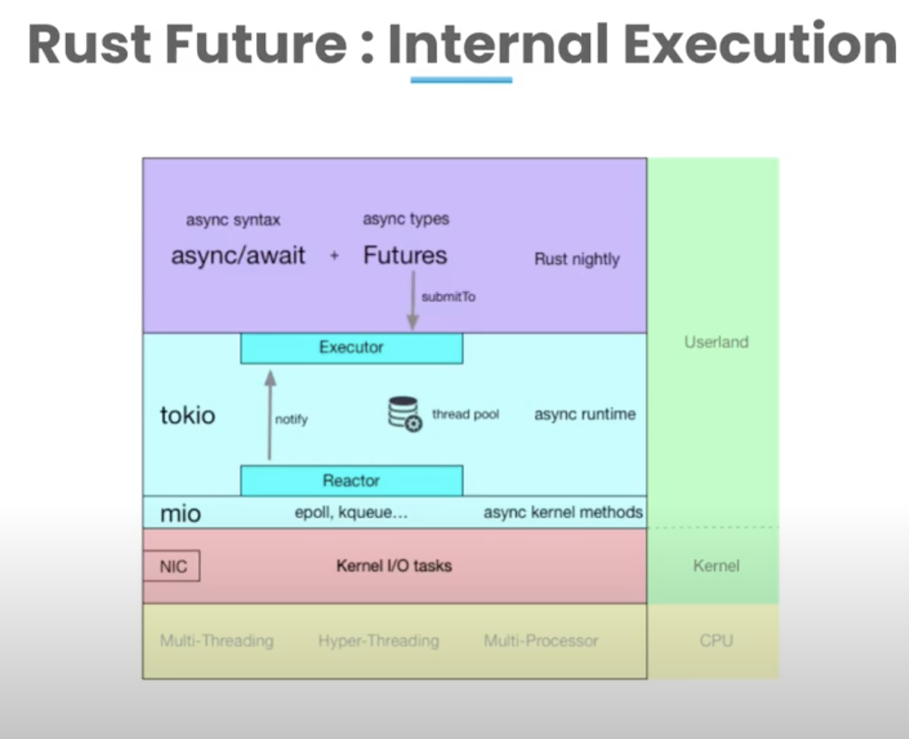

# Async

- System Threads
    - Kernel level threads
- Green Threads
    - User level threads

- Async Implementation at a high level has three major components 
    - Executor
    - Reactor
    - XRoutine

- Async
    - Transforms a block of code into a state machine that implements a trait called future
- Await
    - Mechanism to run a future. It asyncronously wait for the future to complete.

- `mio` provides a number of core abstractions for working with I/O resources, such as sockets, pipes, and devices.

- It also provides support for advanced features such as `epoll, kqueue, and IOCP` on different platforms, as well as convenient utility functions for working with I/O events, timeouts, and buffers.

## References

- [Rust's Journey to Async/Await](https://www.youtube.com/watch?v=lJ3NC-R3gSI)
    - Explains how rust got it's `asyncronous` paradigm.
    - First adopted `green threads`. But still performed like one to one native thread.
    - Event loop in javascript allowed asyncronous callbacks with eventing.
    - Go, ruby has blocking syntax with non blocking runtime.
    - Go has stackfull co routines compared to rust stackfull coroutine. 

- [Rundown of Async/Await in Rust](https://www.youtube.com/watch?v=IE91l4kR0wo)
    - Code walkthrough of demo future implementation.

- [Rust Zero Cost Future:](https://www.youtube.com/watch?v=skos4B5x7qE) 
    - Explains future implementaion, benchmark.

- [The Talk You've Been Await-ing for](https://www.youtube.com/watch?v=NNwK5ZPAJCk&t=306s)
    -  Implementaton of executor, Reactor

- [Java Async Dependency Management](https://gist.github.com/benjchristensen/4677544)

- [Under the hood of Futures and Promises in Swift](https://swiftbysundell.com/articles/under-the-hood-of-futures-and-promises-in-swift/)