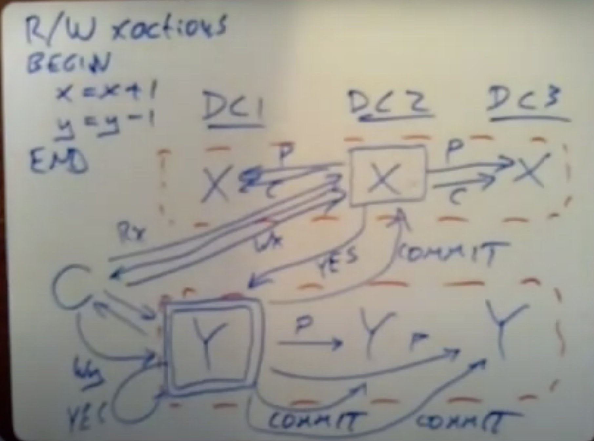

# MIT Parralal and Distributed OS Group

- [**Course Link**](https://pdos.csail.mit.edu/6.824/schedule.html)

### Introduction
- Mapreduce explanation
- General Philosophy

### RPC and Threads
- Threads vs event-driven asynchronous programming
- To get Parrelalism + IO Concurrency fill all threads equal to the core with an event-driven loop
- Go threads are cleverly run on one OS thread
- Code snippets in Go Crawler explained

### GFS
- Two-phase commit

### Primary-Backup Replication
- Multi-core bad for replicated state machine

### Blockstack
- Cryptographic ACL needs Public Key Infrastructure
- Burn Address gets some fee for registering the name
- Certificate Transparency

### Fault Tolerance
- Use of leader in distributed consensus
    - Original Paxos don't have a leader
    - First round to elect a leader, second to decide
    - In the raft, the leader is elected. So speeds up by a factor of two
    - Sequence of leaders identified by followers using the term
    - Back up. Fast
    - Log Compaction
    - Linearizability 
        - All concurrent parallel requests map to one dimension.

### ZooKeeper
- Raft usage requires explicit use in the application which gives distributed consensus
- Zookeeper gives the same as a coordination service
- zookeeper Zab, raft-like
- Writes linearizable, gives zxID, Read fifo client with zxID
- Primary backup system, not state machine replication.
- Configuration management through read locking `ready` file
- Mini Transaction
    - Master state transfer, elect
    - Test and Set
- Api involves a naming system called 'zNodes'
    - Regular permanent zNode
    - Ephemeral zNode - The client needs to continuously end the heartbeat to keep it
    - Sequential
- Herd effect    

### CRAQ
- Chain Replication
- Maintains linearizability unlike zookeeper
- Uses configuration manager. Raft, Paxos, ZooKeeper.
- No worry about partition, split-brain
  
### Aurora
- In each machine, a Virtual machine monitor to monitor ec2
- Website is constructed of stateless services that get persistent data from DB.
- EC2 is not good for DB. As not stateless like service.
- EBS volumes are servers using CRAQ.
- Database on the network generates lots of traffic.
- DB
    - Transaction
    - Crash   Recovery 
- Instead of RDS architecture, Aurora just sends log entries, ack from quoram only.    

### Frangipani
  - Cache coherence
  - Atomicity
  - Crash recovery
- Shared read lock
- Exclusive write lock 
- Cache coherence lock to how updated write, Transactional to delay
- WAL for the crash recoverable transaction, Log on the petal
 
### Distributed Transaction
- Transaction
    - Concurrency control
        - Pessimistic 
            - Locking 
                - More conflict than use it 
            - Two-phase locking 
                - Lock and release at end.
            - Two-phase commit 
                - Distributed transaction 
                - When the content of the atomic commit is in a different server.
            - Transaction Coordinator 
                - Log update as early as possible
            - Two-phase commit and raft 
        - Optimistic
     - Atomic commit
- Serializable or atomic
    - Sequence change but no intermediate state

### Spanner
- CockroachDB uses a lot of design
- Sharding 
    - Key design
- Transactions over multiple shared 
- Paxos replicated
- Transaction
    - Read Write Transaction
    - Read-only transaction
        - Serializable
        - Snapshot isolation
            - TimeStamp 
                - R/W Transaction - Commit Time
                - R/O Transaction - Start Time 
        - In the case of the minority paxos group, delay until
                  
 - External Consistency
 - RO/RW transactions should not see stale data
 - Multi-version DB

- Data across data centers

### Optimistic Concurrency Control
- FARM 
    - Optimized for one data center
- NVRAM
    - Machine with battery attached
- Kernel bypassing
- RDMA Network Interface Card

### Spark
 - Lineage Graph
    - Narrow dependency
    - Wide dependency - Distinct
- Not good for stream processing
- Instead of GFS writing in MapReduce, rdd can be retained in memory.

### Cache consistency
- Four architecture
    - Single Server + DB Server
    - Multiple Server + One DB Server
    - Multiple Server + Sharded DB Server (Hotspot problem)
    - Multiple Server + Cached
- Look aside cache
- Look through the cache
- In cache of memcache failure dramatic increase in DB Server
- Asynchronous log replicated scheme for replication
- RPC call to memcache
    - Cache invalidate scheme - better
    - Cache update scheme    
 partition:
 + more memory-efficient (one copy of each k/v)
 + works well if no key is very popular
 - each web server must talk to many MC servers (overhead)
 replication:
 + good if a few keys are very popular
 + fewer TCP connections
 - less total data can be cached
- When adding a new cluster, no cache can cause a lot of problems
    - Solution: Cold Mode
- Thundering Herd
    - Solve by using a lease. Just a flag.
- Gutter Server
- Race condition
    - Read, miss, but before set write, invalidate happens      

### Casual Consistency
- Interact with only local
- Usage - Cassandra, Dynamo
- Versioning
    - Wall clock

- Photo put, List get example.
- Sync to maintain order. Too slow. 
- Better approach log server. But centralized log means heavy load.
- Dependency maintenance. Better approach.

### Certificate Transparency 
- Merkle inclusion proof
- Log consistency proof

### Bitcoin
- Fee Estimate Algorithm
    - https://blog.iany.me/2020/08/bitcoin-core-fee-estimate-algorithm

### Blockstack

### Final Project
- Search 6.824

---- 

# [CSE 138](https://www.youtube.com/watch?v=G0wpsacaYpE&list=PLNPUF5QyWU8O0Wd8QDh9KaM1ggsxspJ31&ab_channel=LindseyKuper)

### Lecture 2
- Distributed Systems = Partial Failure + Unbounded Latency
- Physical Clock 
    - Time of day clock
        - Synced with NTP
        - Bad for duration, time label
    - Monotonic clock
        - Counter
        - Bad for time label
        - Good for duration
- Logical Clock
    - Only ordering of event

### Lecture 3

Lamport Diagrams / Space Time Diagrams

A -> B when,
- A happens before B in the same machine
- A send B receive in different machine
- Transitive closure
- Causal anomaly

Network mode
- Synchronous 
- Asynchronous

# Waterloo
 
### Lecture 1

- Any big thing structure. Hierarchy 
- DNS
- Implicit hierarchy
- Ip address geographically dispersed
- Split up geo or data center 
- Topology

**Lecture 2**

- Youtube pull replication
- Push replication for popular
- DNS
    - CN - Canonical name
    - NS - Name Server
    - A - Address

**Lecture 6**

- SOCKET TABLE
    - SOCKET is an index to socket table, which has all the information necessary.
    - SOCKET File Descriptor is an index. Just integer.
- SOCK ADDR_IN
    - Address family
        - AF_INET
        - AF_unix (Client-server on same machine)
    - IP address
        - From client - Server IP
        - From server - Any
    - Port number
        - From client - Server's port
        - From server - Listen on port
- HOST ENT
    - Destination
        - What is returned by DNS?
- TCP - SOCK_STREAM - CONNECTION ORIENTED
- UDP - SOCK_DGRAM - DATAGRAM

- htons(PORT -> host byte order to network byte order

- [Socket programming](https://www.youtube.com/watch?v=2QeL7jo_LIw&list=PLawkBQ15NDEkDJ5IyLIJUTZ1rRM9YQq6N)
- [SOCEKT PROGRAMMING](https://www.geeksforgeeks.org/socket-programming-cc/) 
- [Princeton systems course](https://medium.com/princeton-systems-course)

**Lecture 7**
- Flow control part of the transport layer
- Congestion control part of the network layer
- Ports are 16 bits