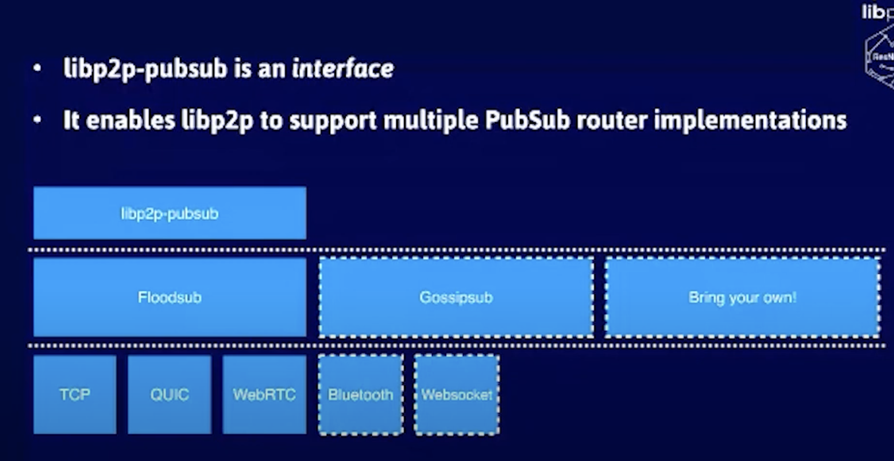

# EVM

- [EVM: From Solidity to byte code, memory and storage](https://www.youtube.com/watch?v=RxL_1AfV7N4)
    - Solidity and viper EVM language which generates `.bin` and `.abi`
    - Transactions are not part of world state or state tree
        - It will be part of information that gets linked to block header which is summary of all transactions
    - Contract is transaction with no to address, and only data
    - Full flow walkthrough

- [Reversing Ethereum Smart Contracts to find out what's behind EVM bytecode (Devcon4)](https://www.youtube.com/watch?v=IEvRRszoTeE)

- [Blockchain / Crosschain / DeFi Bridge Design](https://youtu.be/zq4cbS3q-lY)

- [Ethereum/EVM Smart Contract Reverse Engineering & Disassembly - Blockchain Security #3](https://www.youtube.com/watch?v=I6VDBvX9Pkw)
    - Bytecode
        - Loader code
            - Execute once to store runtime code
        - Runtime code
            - Can map bytecode to evm assembly
            - Reconstruct control flow graph
            - Runtime code entry point is dispatcher function
                - Switch to first four bytes of transaction payload
                - Execute associated code with given function signature
                - Signature Database - https://www.4byte.directory
                - Security Analysis Tool
                    - https://github.com/pventuzelo/octopus
                    - https://github.com/ConsenSys/mythril
                    - https://github.com/crytic/rattle
                    - https://www.ethervm.io
        - Swarm hash
            - Merkle tree hash to retrieve

- [SputnikVM: Rust Ethereum Virtual Machine Implementation](https://github.com/rust-blockchain/evm)

- [Bridge/ Crosschain Bridge/ Defi Bridge](https://youtu.be/zq4cbS3q-lY)
    - Why?
        - Transaction fees
        - Block confirmation times
        - Liquidity Pool
    - CrossChain Protocol Stack
        - Application
            - Built on function
        - Funciton Call
            - Execution
        - Messaging
            - Verificaiton
    - Ethereum Event
        - Event can be proven to come from certain blockchain 
    - Hash Timelock Contracts (HTLC) - Trustless
        - Decentralized exchange can only trade for assets on same blockchain
        - Atomic Swaps 
        - https://www.youtube.com/watch?v=VZX2ApRLuwM

# [Gossipsub - A gossip-based pubsub protocol By Yiannis Psaras @ Paris P2P Festival #1](https://youtu.be/VEEEaf8B35w)
    - Floodsub -> RandomSub -> GossipSub
    - Eager push
    - Lazy pull 
    - Peer scoring each node
    - Keep connection with the highest score
    - First message flood
    - Then adaptive, flood local mesh, lazy pull others
    - Backoff and prune based on score
    - Sybil Attack
    - Eclipse Attack
    - Cold Boot Attack
    - Covert flash Attack

- [Gossipsub v1.1 - A scalable, extensible & hardened P2P PubSub Router protocol with David Dias](https://youtu.be/H9Eb4uftrSA)
    - p2p pubsub system
    - randomsub
    - Peer excahnge on prune
    - Epidemic broadcast tree
    - Bitswap
    - Ambient discovery reduced by swapping
    - episub

- [Demystifying libp2p Gossipsub: A Scalable and Extensible p2p Gossip Protocol by Raúl Kripalani](https://youtu.be/BUc4xta7Mfk)
    - Ambient peer discovery
    - IHAVE gossip
    - IWHAT gossip

