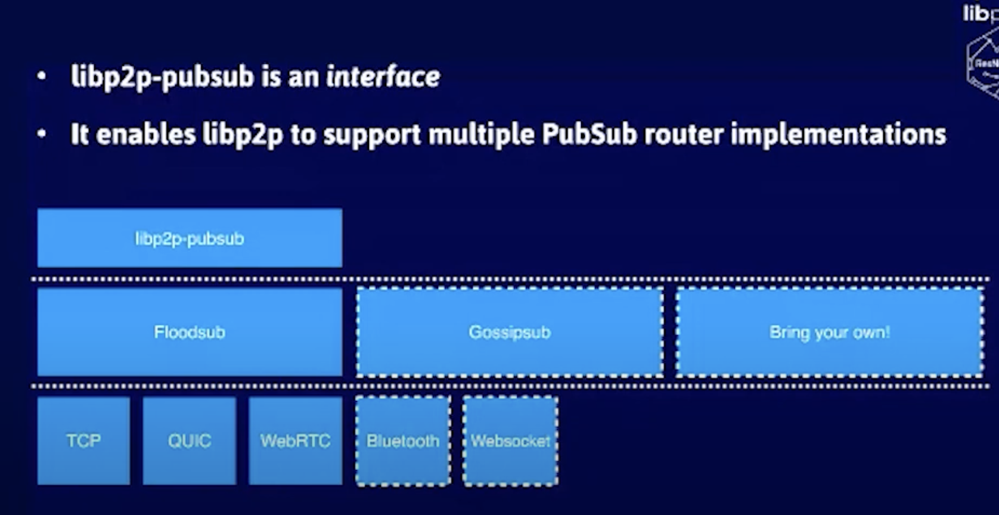

# Walk through EVM

# [Gossipsub - A gossip-based pubsub protocol By Yiannis Psaras @ Paris P2P Festival #1](https://youtu.be/VEEEaf8B35w)
    - Floodsub -> RandomSub -> GossipSub
    - Eager push
    - Lazy pull 
    - Peer scoring each node
    - Keep connection with the highest score
    - First message flood
    - Then adaptive, flood local mesh, lazy pull others
    - Backoff and prune based on score
    - Sybil Attack
    - Eclipse Attack
    - Cold Boot Attack
    - Covert flash Attack

- [Gossipsub v1.1 - A scalable, extensible & hardened P2P PubSub Router protocol with David Dias](https://youtu.be/H9Eb4uftrSA)
    - p2p pubsub system
    - randomsub
    - Peer excahnge on prune
    - Epidemic broadcast tree
    - Bitswap
    - Ambient discovery reduced by swapping
    - episub

- [Demystifying libp2p Gossipsub: A Scalable and Extensible p2p Gossip Protocol by Raúl Kripalani](https://youtu.be/BUc4xta7Mfk)
    - Ambient peer discovery
    - IHAVE gossip
    - IWHAT gossip

