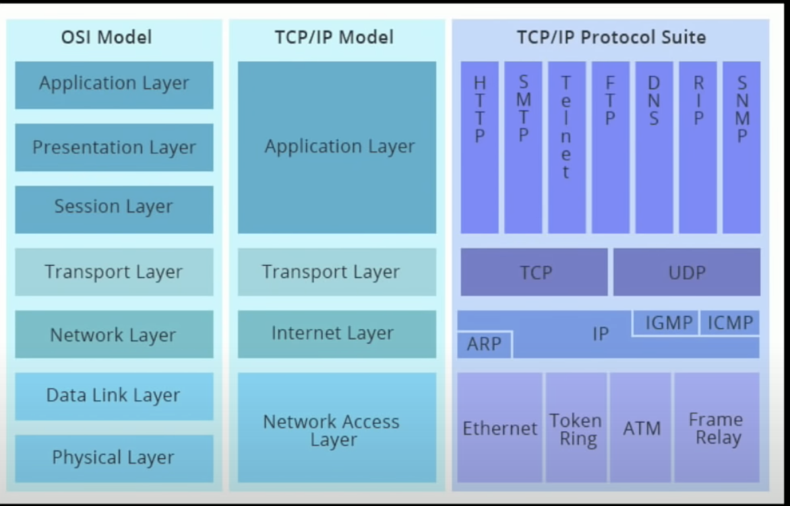

# libp2p



- p2p network composed of four elements
    - Each node identified by `public key`
        - Hash of small data structure containing RSA, ed25519, ecp256k1 etc
    - `Peer Discovery` system, joining
        - Discover nodes on  local network, DNS, DNS-SD
        - Bootstrap node
    - `pubsub` to broadcast event
    - `DHT` to store data

- p2p connection setup steps
    - open a connection
    - negotiate encryption protocol
    - on top of encryption multiplexing protocol
        - [yamux](https://github.com/hashicorp/yamux)
    - each high level request opens up substream

- IPFS Content addressing
    - Find, Fetch, Authenticate
- libp2p Process Addressing
    - Find, Connect, Authenticate
- Multi Address
    - A Multiaddr is a self-describing network address and protocol stack that is used to establish connections to peers.
    
```
/ip4/80.123.90.4/tcp/5432
/ip6/[::1]/udp/10560/quic
/unix//path/to/socket
```

## References
- [libp2p introduction](https://www.youtube.com/watch?v=CRe_oDtfRLw)
- [quic](https://www.youtube.com/watch?v=4FvMed5iCb4)
- [libp2p Rust](https://www.youtube.com/watch?v=Sss2Tl7WRDQ) 
- [Demo Project](https://github.com/tomaka/2018-rustrush-demo)