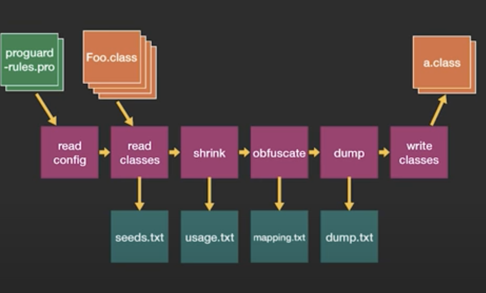

# ADB



- ADB reboot-bootloader and reboot recovery commands
    - This command will let you reboot your device in the bootloader. 
    - If due to some malware, your device is stuck or if your device is not rebooting then you can connect your device to the computer and run this command to reboot. 
    - To run the command just type adb reboot-bootloader in the command line and to boot the device in recovery just type adb reboot recovery.

- Fastboot device command
    - Fastboot is a diagnostic and engineering protocol that you can boot your Android device into. 
    - ADB does not work in the bootloader. 
    - If you have to boot into Android and the debugging tools are not active to communicate then you can use the fastboot command. 
    - Type fastboot devices in the prompt and you get the serial number.

- Fastboot unlock command
    - Fastboot flashing unlock command unlocks your bootloader.
    - This command is not supported in many phones that support fastboot but you can check if your phone supports it. 
    - Just type fastboot flashing unlock in the command prompt and hit enter.

- ADB sideload command:
    - You can download the update zip file on your phone instead of waiting for the update to be pushed into the phone. 
    - To do that just download the update to your computer and connect your device to the computer. 
    - Now reboot into recovery on your phone and using the volume buttons choose to apply an update from ADB. Then open a command line type ADB sideload Full-Path-to-the-file.zip and hit enter.


```sh

# Prints the path to the APK of the given package.
adb shell pm path <PACKAGE>

# Downloads or pulls a specified file from an emulator/device to your computer (host).
adb pull <remote> [local]
unzip app 

# Use dex2jar then jd-cli

# collects battery data from your device
adb shell dumpsys battery stats  

adb cd <directory>
adb shell ls
adb shell ls -a

# print the size of each file, in blocks
adb shell ls -s                             

# list numeric UIDs and GIDs
adb shell ls -n                             

# list subdirectories recursively
adb shell ls -R

# Test the connection & latency between two network connections
ping [options] <destination>    

# manage and configure network connections via profiles.
netcfg [<interface> {dhcp|up|down}] 

# Show, and manipulate routing, devices, policy routing, and tunnels.
ip [options] object                         

--object := { link | addr | addrlabel | route | rule | neigh | ntable |tunnel | tuntap | maddr | mroute | mrule | monitor | xfrm |netns | l2tp }

--options := { -V[ersion] | -s[tatistics] | -d[etails] | -r[esolve] |-f[amily] { inet | inet6 | ipx | dnet | link } |-l[oops] { maximum-addr-flush-attempts } |-o[neline] | -t[imestamp] | -b[atch] [filename] |-rc[vbuf] [size]}

# prints log data on the screen
logcat

# list tcp connectivity
adb shell netstat                           

# print current working directory location
adb shell pwd                               

# dumps state
adb shell dumpstate                         

# print process status
adb shell ps                                

# dumps system data
dumpsys [options]                           

# dumps state
dumpstate                               

# takes a screenshot of the device’s display
screencap <filename>                            

# records screen. Requires: Android 4.4 (API level 19) or higher
screenrecord [options] <filename>                   

# displays top CPU processes
top [options]                       

# get property via the Android property service
getprop [options]

# This command is used to set property service
setprop <key> <value>                           

# unlocks the bootloader on the device
fastboot oem unlock                         

# used to relock the bootloader on the device
fastboot oem lock                           

# prints bootloader lock/unlock status
fastboot oem device-info                        

# flashes recovery image to the device
fastboot flash recovery <file-name.img>                 

# Boot the image file without installing or flashing on the device. Can be used to boot recovery images without flashing on the device

fastboot boot <file-name.img>

# flashes flashable zip file from fast boot or bootloader mode
fastboot flash <file.zip>                       

# displays CID (Carrier ID) of the device
fastboot getvar cid                         

# restarts the adbd daemon with root permissions
adb root                                

# run an Android package
pip install monkey:
monkey -p com. package.name -c android.intent.category.LAUNCHER 1    

# open browser
am start -a android.intent.action.VIEW -d               

# open gallery
am start -t image/* -a android.intent.action.VIEW           

# force the app to stop.
am force-stop app. package.name                      

# To back up all the device and app data. When executed, it will trigger the backup, ask you to accept the action on the Android device, and then create a “backup.adb” file in the current directory.
backup -all                             

# Prints a list of all attached devices with USB Debugging enabled. In response, it returns the serial number and state of the device.
adb devices

# Forwards the socket connections. It required USB Debugging enabled on the device.
adb forward <local> <remote>

# Terminates the adb server process. Sometimes you might want to terminate the adb server and restart it to resolve the problems.
adb kill-server

# Allows using adb over Wi-Fi. This requires the host and the device connected to the same Wi-Fi network.
adb connect <host>[:<port>]

# Restarts ADB in USB mode.
adb usb

# Pushes an Android application (.apk) from the host to an emulator or the device.
adb install [option] <path to .apk>

# Uninstalls or removes the package from the emulator or Android device.
adb uninstall [option] <PACKAGE>

# Prints all packages installed on the device/emulator.
adb shell pm list packages [options] <FILTER>

# Deletes all the data associated with the package (clears app data and cache).
adb shell pm clear <PACKAGE>

# Upload or push or copy a file from the host (computer) to an emulator or the device.
adb push <local> <remote>

```