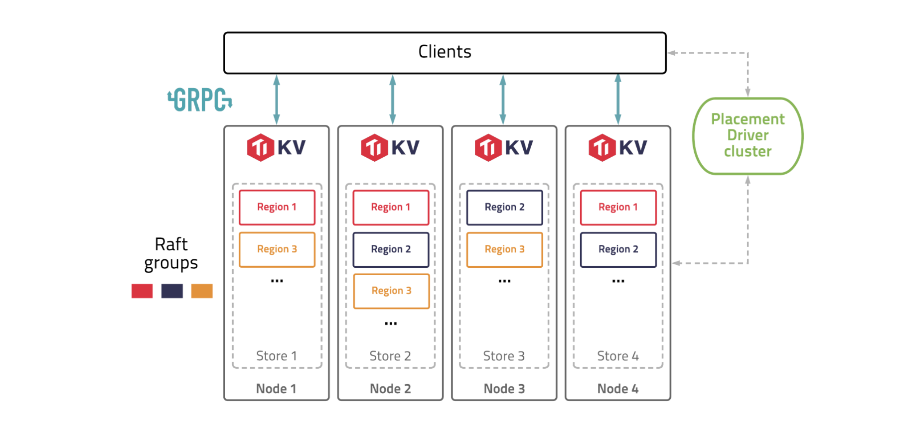
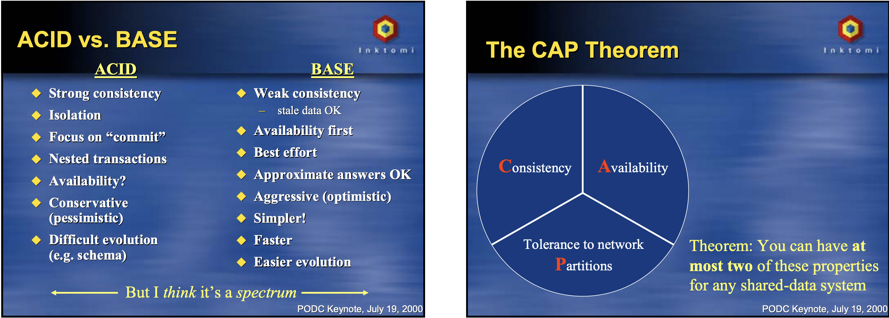

## [Amethyst](https://github.com/amethyst/amethyst)
- For graphincs [Render Engine](https://github.com/bjorn/tiled)
- From c++ to rust, game ecosystem moving towards
- ECS - Entity Component System

## [Bevy](https://github.com/bevyengine/bevy)
- Simple game engine. easy to start

## [TiKV](https://github.com/tikv/tikv)

- TiKV is an open-source, distributed, and transactional key-value database.
- TiDB built after Google F1 and TiKV after Google Spanner.
- Each node has RocksDB for Raft
- Uses Multiversion Concurrency Control

## [CockroachDB](https://github.com/cockroachdb/cockroach)

## Multiverssion Concurrency Control

Traditional RDBMS, like PostgreSQL, that provide ACID guarantees, favor consistency over availability. BASE (Basic Availability, Soft-state, Eventual consistency) systems, like MongoDB and other NoSQL systems, favor availability over consistency. 

- Pessimistic
    - Lock and chage
    - Two phase lock
- Optimistic
    - First perform change in protected area, then change current state. 
    - `MVCC` is one of that.
    - Core idea  - Database Version
    - Three Phases of Optimistic
        - Simulation
        - Validation
        - Commit 

## [NUM_CPUS](https://github.com/seanmonstar/num_cpus/)
- Different architecture os handle in rust
- Various os primitives to get logical & physical cores

# Resources
- [Multiversion Concurrency Control](https://www.youtube.com/watch?v=sxabCqWsFHg)
- [MCC](https://en.wikipedia.org/wiki/Multiversion_concurrency_control) - Description Section Helpful 
- [CAP Keynote](https://awoc.wolski.fi/dlib/big-data/Brewer_podc_keynote_2000.pdf)

## [Worker Pool](https://github.com/inaka/worker_pool)